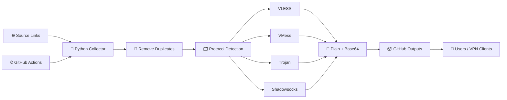

<div dir="rtl" align="center">

# ⚡ POPVPN
### 🚀 سیستم هوشمند جمع‌آوری، پاک‌سازی و انتشار کانفیگ‌های VPN

[](https://github.com/pouria08/popvpn/actions)
[](https://github.com/pouria08/popvpn/tree/main/outputs)
[](https://github.com/pouria08/popvpn)
[](https://www.python.org/)

<br>

<a href="https://github.com/pouria08/popvpn">
  
</a>

<br><br>

**یک مخزن سبک، خودکار و کاربردی برای جمع‌آوری کانفیگ‌ها، حذف موارد تکراری، دسته‌بندی پروتکل‌ها و انتشار لینک‌های آماده اشتراک**

</div>

---

## 🌟 POPVPN چیست؟

**POPVPN** یک pipeline خودکار مبتنی بر Python و GitHub Actions است که منابع تعریف‌شده در `links.txt` را دریافت می‌کند، کانفیگ‌ها را استخراج و Deduplicate می‌کند، سپس خروجی‌ها را بر اساس پروتکل در فایل‌های جداگانه منتشر می‌کند.

> 🔄 فرآیند بروزرسانی طبق Workflow فعلی، **هر یک ساعت** اجرا می‌شود و در صورت تغییر، خروجی‌ها در مخزن Commit می‌شوند.

### ✨ امکانات اصلی

| قابلیت | وضعیت |
|---|:---:|
| 🔄 بروزرسانی خودکار | ✅ |
| ⏱ اجرای ساعتی | ✅ |
| 🧹 حذف کانفیگ‌های تکراری | ✅ |
| 🗂 دسته‌بندی بر اساس پروتکل | ✅ |
| 🔐 خروجی Base64 | ✅ |
| 📄 خروجی متنی مستقیم | ✅ |
| 📊 فایل آمار | ✅ |
| 🔗 لینک مستقیم Raw | ✅ |
| 🐍 Python Pipeline | ✅ |
| 🤖 GitHub Actions | ✅ |

---

# 🚀 لینک‌های آماده اشتراک

> **پیشنهاد:** اگر کل لیست را می‌خواهید از `working_configs.txt` یا `base64.txt` استفاده کنید.  
> اگر فقط یک پروتکل خاص لازم دارید، لینک همان پروتکل را انتخاب کنید.

## 🏆 اشتراک کامل

### 🔥 همه کانفیگ‌های فعال — Plain Text

**لینک اشتراک:**

```text
https://raw.githubusercontent.com/pouria08/popvpn/main/working_configs.txt
```

[🔗 باز کردن اشتراک کامل](https://raw.githubusercontent.com/pouria08/popvpn/main/working_configs.txt)

### 🔐 همه کانفیگ‌ها — Base64

```text
https://raw.githubusercontent.com/pouria08/popvpn/main/base64.txt
```

[🔗 باز کردن نسخه Base64](https://raw.githubusercontent.com/pouria08/popvpn/main/base64.txt)

---

# 🎯 لینک‌های تفکیک‌شده بر اساس پروتکل

## 🟣 VLESS

### Plain
```text
https://raw.githubusercontent.com/pouria08/popvpn/main/outputs/vless_configs.txt
```

[🔗 دریافت VLESS](https://raw.githubusercontent.com/pouria08/popvpn/main/outputs/vless_configs.txt)

### Base64
```text
https://raw.githubusercontent.com/pouria08/popvpn/main/outputs/vless_base64.txt
```

[🔐 دریافت VLESS Base64](https://raw.githubusercontent.com/pouria08/popvpn/main/outputs/vless_base64.txt)

---

## 🔵 VMess

### Plain
```text
https://raw.githubusercontent.com/pouria08/popvpn/main/outputs/vmess_configs.txt
```

[🔗 دریافت VMess](https://raw.githubusercontent.com/pouria08/popvpn/main/outputs/vmess_configs.txt)

### Base64
```text
https://raw.githubusercontent.com/pouria08/popvpn/main/outputs/vmess_base64.txt
```

[🔐 دریافت VMess Base64](https://raw.githubusercontent.com/pouria08/popvpn/main/outputs/vmess_base64.txt)

---

## 🟠 Trojan

### Plain
```text
https://raw.githubusercontent.com/pouria08/popvpn/main/outputs/trojan_configs.txt
```

[🔗 دریافت Trojan](https://raw.githubusercontent.com/pouria08/popvpn/main/outputs/trojan_configs.txt)

### Base64
```text
https://raw.githubusercontent.com/pouria08/popvpn/main/outputs/trojan_base64.txt
```

[🔐 دریافت Trojan Base64](https://raw.githubusercontent.com/pouria08/popvpn/main/outputs/trojan_base64.txt)

---

## 🟢 Shadowsocks

### Plain
```text
https://raw.githubusercontent.com/pouria08/popvpn/main/outputs/shadowsocks_configs.txt
```

[🔗 دریافت Shadowsocks](https://raw.githubusercontent.com/pouria08/popvpn/main/outputs/shadowsocks_configs.txt)

### Base64
```text
https://raw.githubusercontent.com/pouria08/popvpn/main/outputs/shadowsocks_base64.txt
```

[🔐 دریافت Shadowsocks Base64](https://raw.githubusercontent.com/pouria08/popvpn/main/outputs/shadowsocks_base64.txt)

---

# 📊 وضعیت و آمار

برای مشاهده آخرین خلاصه آماری Pipeline:

```text
https://raw.githubusercontent.com/pouria08/popvpn/main/stats.txt
```

[📈 مشاهده آمار فعلی](https://raw.githubusercontent.com/pouria08/popvpn/main/stats.txt)

همچنین می‌توانید تمام فایل‌های خروجی را از پوشه زیر مشاهده کنید:

[📂 مشاهده پوشه Outputs](https://github.com/pouria08/popvpn/tree/main/outputs)

---

# 📱 آموزش استفاده برای کاربران

## Android — v2rayNG / Hiddify / NekoBox

1. یکی از لینک‌های بالا را انتخاب کنید.
2. در برنامه وارد بخش **Subscription / Subscriptions** شوید.
3. لینک را Paste کنید.
4. گزینه **Update / Refresh** را بزنید.
5. یکی از کانفیگ‌ها را انتخاب و Connect کنید.

### 💡 پیشنهاد

برای استفاده عمومی، این لینک را امتحان کنید:

```text
https://raw.githubusercontent.com/pouria08/popvpn/main/working_configs.txt
```

اگر برنامه شما Base64 را بهتر می‌خواند:

```text
https://raw.githubusercontent.com/pouria08/popvpn/main/base64.txt
```

---

## 🖥 Windows — v2rayN

1. برنامه را باز کنید.
2. وارد **Subscription Group** شوید.
3. گزینه افزودن Subscription را انتخاب کنید.
4. یکی از لینک‌های POPVPN را در URL قرار دهید.
5. Update Subscription را بزنید.
6. کانفیگ موردنظر را انتخاب کنید.

---

## 🍎 iPhone / iPad — Shadowrocket و کلاینت‌های مشابه

1. برنامه را باز کنید.
2. بخش Subscription / Subscribe را پیدا کنید.
3. لینک POPVPN را Paste کنید.
4. Update کنید.
5. کانفیگ را انتخاب کنید.

> پشتیبانی دقیق هر اپ از فرمت‌های Plain/Base64 متفاوت است؛ اگر یک فرمت جواب نداد، نسخه Base64 همان پروتکل را امتحان کنید.

---

# 🧩 کدام لینک را انتخاب کنم؟

| نیاز شما | لینک پیشنهادی |
|---|---|
| همه پروتکل‌ها | `working_configs.txt` |
| همه پروتکل‌ها با Base64 | `base64.txt` |
| فقط VLESS | `outputs/vless_configs.txt` |
| فقط VLESS Base64 | `outputs/vless_base64.txt` |
| فقط VMess | `outputs/vmess_configs.txt` |
| فقط VMess Base64 | `outputs/vmess_base64.txt` |
| فقط Trojan | `outputs/trojan_configs.txt` |
| فقط Trojan Base64 | `outputs/trojan_base64.txt` |
| فقط Shadowsocks | `outputs/shadowsocks_configs.txt` |
| فقط Shadowsocks Base64 | `outputs/shadowsocks_base64.txt` |

---

# ⚙️ معماری پروژه



---

# 🔄 سیستم بروزرسانی خودکار

Workflow پروژه در مسیر زیر قرار دارد:

```text
.github/workflows/update.yml
```

طبق تنظیم فعلی، GitHub Actions هر ساعت اجرا می‌شود:

```yaml
schedule:
  - cron: '0 * * * *'
```

### روند اجرای خودکار

```text
⏰ Trigger
   ↓
📥 Checkout Repository
   ↓
🐍 Setup Python
   ↓
📦 Install Dependencies
   ↓
🌐 Download Sources
   ↓
🧹 Remove Duplicates
   ↓
🗂 Categorize Protocols
   ↓
📄 Generate Outputs
   ↓
📊 Update Stats
   ↓
💾 Commit Changes
```

---

# 🌐 منابع ورودی فعلی

منابعی که در `links.txt` تعریف شده‌اند:

```text
https://raw.githubusercontent.com/RKPchannel/RKP_bypass_configs/refs/heads/main/whitelist.txt

https://raw.githubusercontent.com/patterniha/Free-Configs/main/configs.txt

https://raw.githubusercontent.com/pouria08/popvip/refs/heads/master/Eternity.txt

https://9dz4quexuuos.javad-ghoreyshi11.workers.dev/feed/pouria2
```

> برای اضافه کردن Source جدید، کافی است URL را در `links.txt` در یک خط جداگانه قرار دهید و Workflow را اجرا کنید.

---

# 🛠️ ساختار پروژه

```text
popvpn/
│
├── .github/
│   └── workflows/
│       └── update.yml
│
├── outputs/
│   ├── vless_configs.txt
│   ├── vless_base64.txt
│   ├── vmess_configs.txt
│   ├── vmess_base64.txt
│   ├── trojan_configs.txt
│   ├── trojan_base64.txt
│   ├── shadowsocks_configs.txt
│   └── shadowsocks_base64.txt
│
├── links.txt
├── main.py
├── requirements.txt
├── working_configs.txt
├── base64.txt
└── stats.txt
```

---

# 🧠 منطق پردازش

POPVPN در حال حاضر این مراحل را انجام می‌دهد:

### 1. دریافت Source
از تمام URLهای موجود در `links.txt` داده دریافت می‌شود.

### 2. تشخیص Base64
اگر محتوای Source به شکل Base64 باشد، Pipeline تلاش می‌کند آن را Decode کند.

### 3. حذف Duplicate
کانفیگ‌های تکراری بر اساس بخش اصلی URL حذف می‌شوند.

### 4. تشخیص پروتکل
کانفیگ‌ها بر اساس Prefix شناسایی می‌شوند:

```text
vless://
vmess://
trojan://
ss://
shadowsocks://
```

### 5. نام‌گذاری
برای خروجی‌ها نام استاندارد POP ساخته می‌شود:

```text
POP PING | 1
POP PING | 2
POP PING | 3
...
```

### 6. تولید خروجی
برای هر پروتکل دو نوع فایل ایجاد می‌شود:

```text
Plain Text
Base64
```

---

# ⚠️ نکته مهم درباره وضعیت تست

در نسخه فعلی کد، تابع `test_and_filter_config()` به‌صورت **placeholder/simulation** پیاده‌سازی شده و هنوز تست واقعی Ping، اتصال، Download و Upload انجام نمی‌دهد.

بنابراین بهتر است در README از عبارت‌هایی مثل **«تمام کانفیگ‌ها واقعاً تست شده‌اند»** استفاده نشود، مگر اینکه ماژول تست واقعی به پروژه اضافه شود.

این موضوع قابل ارتقاست و می‌توان در نسخه بعدی سیستم واقعی برای:

- ⚡ Ping / Latency
- 🌐 TCP/HTTP Connectivity
- 📥 Download Speed
- 📤 Upload Speed
- 🟢 Healthy / 🔴 Dead
- 🌍 Country Detection
- 📊 Ranking

اضافه کرد.

---

# 🔗 لینک‌های مهم پروژه

| بخش | لینک |
|---|---|
| 🏠 Repository | https://github.com/pouria08/popvpn |
| ⚙️ GitHub Actions | https://github.com/pouria08/popvpn/actions |
| 📂 Outputs | https://github.com/pouria08/popvpn/tree/main/outputs |
| 📄 Working Configs | https://github.com/pouria08/popvpn/blob/main/working_configs.txt |
| 🔐 Base64 | https://github.com/pouria08/popvpn/blob/main/base64.txt |
| 📊 Stats | https://github.com/pouria08/popvpn/blob/main/stats.txt |
| 🔗 Sources | https://github.com/pouria08/popvpn/blob/main/links.txt |

---

# 🧪 اجرای دستی Workflow

اگر نمی‌خواهید منتظر اجرای زمان‌بندی بمانید:

**GitHub → Actions → Auto Update Subscriptions → Run workflow**

بعد از اجرای موفق، فایل‌های خروجی به‌روزرسانی می‌شوند.

---

# 🧑‍💻 اجرای محلی

```bash
git clone https://github.com/pouria08/popvpn.git
cd popvpn

pip install -r requirements.txt

python main.py
```

پس از اجرا، خروجی‌ها در:

```text
outputs/
working_configs.txt
base64.txt
stats.txt
```

قرار می‌گیرند.

---

# 📌 نکات مهم برای کاربران

- 🔄 لینک‌های اشتراک را مستقیماً در کلاینت خود وارد کنید.
- ♻️ برای دریافت آخرین نسخه، Subscription را Refresh/Update کنید.
- 🧩 اگر یک لینک پروتکلی برای کلاینت شما مناسب نیست، نسخه Base64 آن را امتحان کنید.
- 📱 در موبایل معمولاً لینک اشتراک کامل ساده‌ترین انتخاب است.
- 🖥 در کلاینت‌هایی که انتخاب پروتکل مهم است، لینک اختصاصی همان پروتکل را استفاده کنید.

---

# 🔐 حریم خصوصی و مسئولیت استفاده

این پروژه صرفاً یک ابزار فنی برای جمع‌آوری، پردازش و انتشار داده‌های عمومی کانفیگ است.

کانفیگ‌های موجود در منابع ورودی ممکن است توسط اشخاص یا پروژه‌های ثالث منتشر شده باشند و کیفیت، پایداری، امنیت یا مالکیت آن‌ها توسط این پروژه تضمین نمی‌شود.

**قبل از استفاده در محیط‌های حساس، منبع و امنیت کانفیگ را بررسی کنید.**

---

# 🤝 مشارکت

اگر Source جدید، بهبود کد، Bug Fix یا پیشنهاد فنی دارید:

1. Repository را Fork کنید.
2. تغییرات خود را اعمال کنید.
3. Pull Request ایجاد کنید.

---

<div align="center">

## ⭐ اگر POPVPN برای شما مفید بود

**یک Star به Repository بدهید تا پروژه بیشتر دیده شود.**

[](https://github.com/pouria08/popvpn)
[](https://github.com/pouria08/popvpn)

<br>

### ⚡ POPVPN
**Fast • Automated • Organized • Open**

</div>
